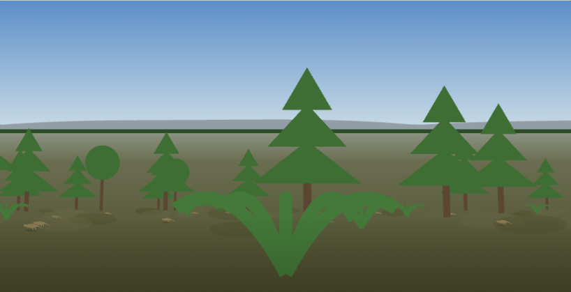
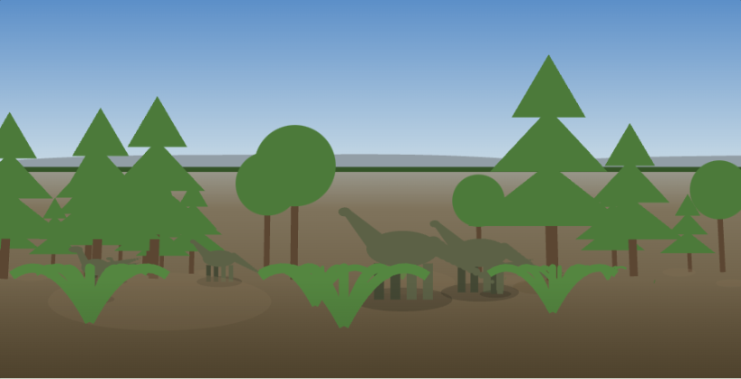
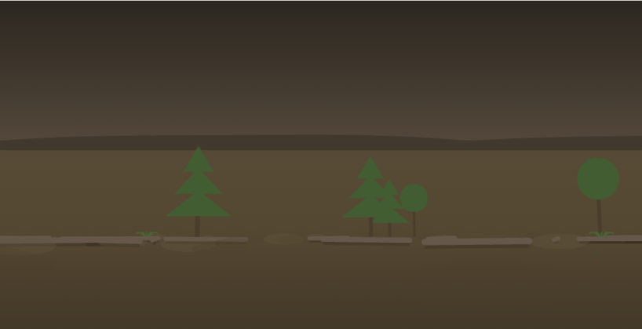
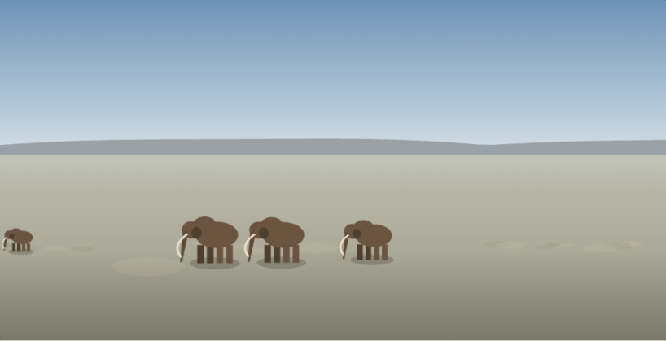
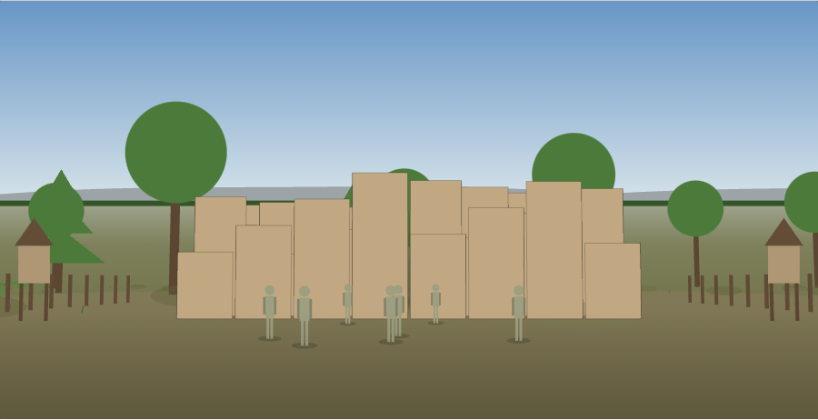
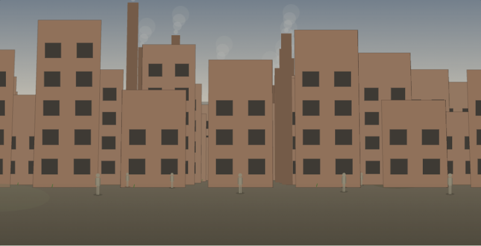
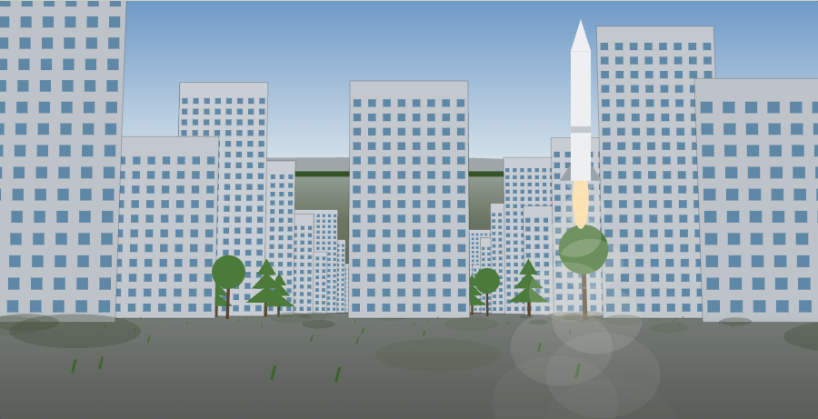
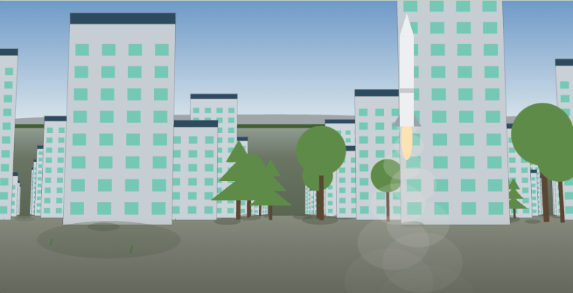

# 地表の八景

象徴的な1枚と、その説明。[R1 絵コンテ](STORYBOARD.md)の地表側を、
1カット1枚の形で並べ直したもの。

11時代のうち8つを扱う。冥王代・最初の海・全球凍結の3つは地表の場面を持つが、
遠景の写真を当てていないため、ここには含めていない。

絵の数値は実装から読んだ。出どころは
`unity/CivilizationToSpace/Assets/Scripts/View/SurfaceCatalog.cs`、
既定の視点の決まりは同ファイルの `DefaultsToSurface`、
構成は [STORYBOARD.md](STORYBOARD.md) と [SURFACE_SCENE_SPEC.md](SURFACE_SCENE_SPEC.md)。
いずれもコミット `6d28388` 時点。

画は [storyboard/eight-ground-scenes.html](storyboard/eight-ground-scenes.html) が
その数値から描いている。PNGはそのページを写したもので、手で描き足していない。

**これは絵コンテであって、実装画面ではない。** Unityの画は写真を遠景に敷き、
光は時刻で動く。ここでは空を塗りで置き換え、光を固定している。
形・数・配置・色の対応を見るための絵である。

---

## 04 森林と陸上生態系 — GreenEarth

霧の森。高さ30mの木が立ち並び、足もとをシダと下草が埋める。低く這う四肢動物が16匹いる。

なぜこの1枚か。森ができたことは、宇宙から見れば緑が増えるだけになる。
木の高さと林床の暗さは、下から見上げないと出ない。

| | |
|---|---|
| 既定の視点 | 生きもの寄り |
| 木の高さ | 30 m |
| 針葉樹／広葉樹 | 48／14 |
| シダ／下草 | 56／120 |
| 四肢動物 | 16匹（0.7 m） |
| 遠景 | misty_pines（霧の針葉樹林） |
| 空 | `#5C8FC8` → `#CBDCE6` |
| 地面 | `#55552F` |

要注意。獣が粒にしかならない。木が30mあるためカメラが34m下がり、
0.7mの四肢動物は画面の高さの1%ほどにしかならない。

---

## 05 巨大生物の時代 — Dinosaurs

乾いた野。首の長い竜脚類が3頭、角竜と獣脚類が4頭。地面は土の色へ寄せ、草を減らす。

なぜこの1枚か。中生代に草原は無い。被子植物の草は白亜紀の終わりごろに現れるため、
イネ科の草地を描くと年代が合わない。

| | |
|---|---|
| 既定の視点 | 生きもの寄り |
| 竜脚類の背丈 | 4.7 m（3頭） |
| 角竜 | 2.5 m |
| 獣脚類 | 2.9 m（あわせて4頭） |
| 木の高さ | 26 m |
| 針葉樹／広葉樹 | 42／28 |
| シダ／下草 | 58／110 |
| 遠景 | goegap（乾いた低木の野） |
| 地面 | `#6E5C3E` |

---

## 06 衝突と暗い空 — Impact

同じ野が暗くなる。立木は倒れ、46本の幹が地面に横たわる。空は塵で色を失う。

なぜこの1枚か。巨大生物の時代と同じ場所を使い、空と植生だけを変える。
別の場所にすると、同じ土地に起きた出来事だと読めなくなる。

| | |
|---|---|
| 既定の視点 | 生きもの寄り |
| 倒れた幹 | 46本 |
| 針葉樹／広葉樹 | 10／6（42／28から減る） |
| シダ／下草 | 8／20 |
| 塵 | 0.7 |
| 遠景 | goegap（同じ野。塵で沈める） |
| 空 | `#2A2620` → `#6A5B4A` |

要注意。塵でふさぐときは写真ごと沈める。色を掛けるだけでは青空の青が残るため、
描いた空を次の絵として持たせ、塵の濃さで混ぜている。

---

## 07 氷期のくり返し — IceAge

木が1本も無い。雪と枯れ草の原に、マンモスとケサイが5頭いるだけ。

なぜこの1枚か。草木の数をすべて0にしてある。氷期の原に大きな木が無いことを、数で表している。
背の高さの基準（PlantHeight）も9mまで下げてある。

| | |
|---|---|
| 既定の視点 | 生きもの寄り |
| マンモスの背丈 | 3.7 m |
| ケサイ | 2.0 m（あわせて5頭） |
| 草木の数 | 0 |
| 高さの基準 | 9 m |
| 遠景 | snowy_field（雪の原） |
| 地面 | `#B2AE99` |

---

## 08 人類の広がり — Humans

日干しレンガの家46棟が背中合わせに詰まる。道が無い。壁に戸口も窓も開けず、
屋根の穴から梯子で降りる。縁に高床倉庫6つと囲い。

なぜこの1枚か。チャタルホユック（紀元前7100年ごろ）に基づく。
蓄える建物と囲いが現れることが、狩猟から農耕へ移ったことの印になる。

| | |
|---|---|
| 既定の視点 | 街寄り |
| 建物の高さ | 5 m |
| 間隔 | 1.05 |
| 棟数 | 46 |
| 窓 | 無し |
| 高床倉庫／囲い | 6／あり |
| 人 | 7人 |
| 遠景 | meadow_2（草地） |

---

## 09 産業と機械 — Industrial

煙突が14本立ち、煉瓦色の建屋が96棟。同じ形が反復する。空は灰へ寄り、働く人が12人いる。

なぜこの1枚か。この段階を他から分けるのは煙突と反復の2つ。
動力が人と家畜から機械へ移ったことは煙突で、人が都市へ集まったことは
同じ形の住まいの反復で表す。

| | |
|---|---|
| 既定の視点 | 街寄り |
| 建物の高さ | 14 m |
| 間隔 | 1.35 |
| 棟数 | 96 |
| 煙突 | 14本 |
| 人 | 12人 |
| 遠景 | wide_plain（広い平野） |
| 空 | `#74808C` → `#C8C2B4` |

---

## 10 情報・地球規模接続 — Information

ガラスの高層が150棟、高さ52m。道を挟んで並ぶ。街の手前から機体が上がる。

なぜこの1枚か。打ち上げは地上の出来事である。宇宙を既定にしていたときは、
ロケットが地表にしか出ないため一度も見られなかった。

| | |
|---|---|
| 既定の視点 | 街寄り |
| 建物の高さ | 52 m |
| 間隔 | 2.1 |
| 棟数 | 150 |
| 下草 | 520 |
| 打ち上げ | あり |
| 遠景 | rustig_koppie（開けた丘） |

---

## 11 未来の分岐 — Future

背が52mから30mへ下がり、棟が150から110へ減り、間隔が2.1から3.1へ広がる。
屋根いちめんが発電面の色。木が街に混ざる。

なぜこの1枚か。Society 5.0 は建物の形式で定義された段階ではない。
情報の街を高く大きくしても「同じ街の背が伸びた」にしかならない。
地表に出せる違いは配置にある。

| | |
|---|---|
| 既定の視点 | 街寄り |
| 建物の高さ | 30 m（52 mから下げる） |
| 間隔 | 3.1（2.1から広げる） |
| 棟数 | 110（150から減らす） |
| 針葉樹／広葉樹 | 70／150 |
| 屋根 | 発電面の色 `#2E4A5E` |
| 打ち上げ | あり |
| 遠景 | rustig_koppie（同じ丘） |

---

## 絵と実装のずれ

絵コンテ側だけの都合で、実装と合っていないところを残しておく。

- **光が固定である。** 実装の光は時刻で動く。この絵は一定の方向から当てている。
- **遠景が塗りである。** 実装は写真を敷く。この絵は空の色から作った丘で代えている。
- **機体の置き方。** 打ち上げの2枚だけ、機体を画面の座標で置いている。
  街の数値からは決めていない。
- **描く数の上限。** 木は46本、下草は150、倒木は46で打ち切っている。
  実装の数（下草520など）をそのまま描いてはいない。
- **屋根の発電面。** 目の高さからは屋根の上面が見えないため、
  正面の上端に同じ色の帯を出して手掛かりにしている。
