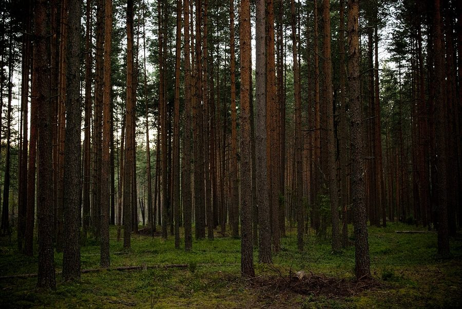
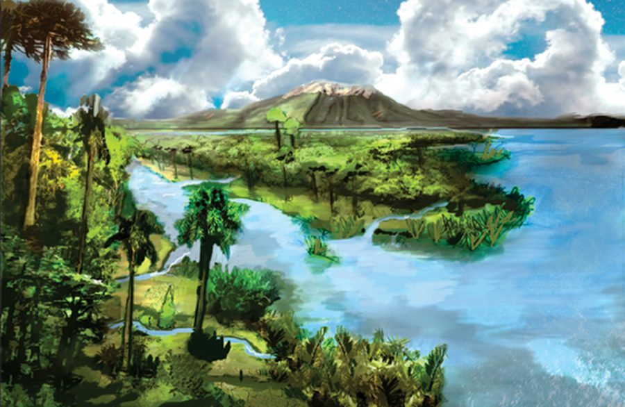
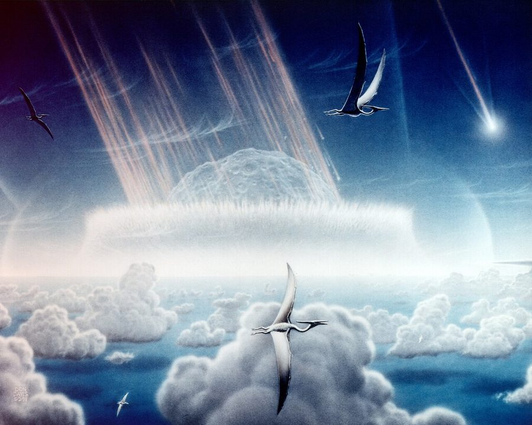
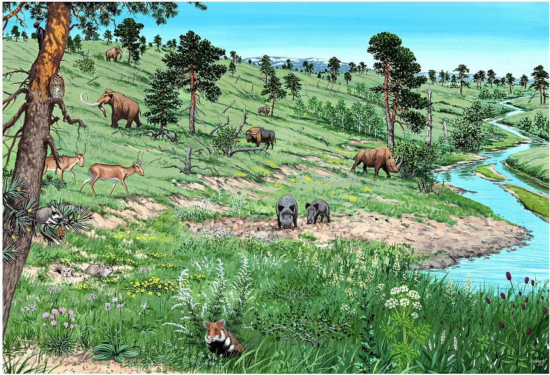
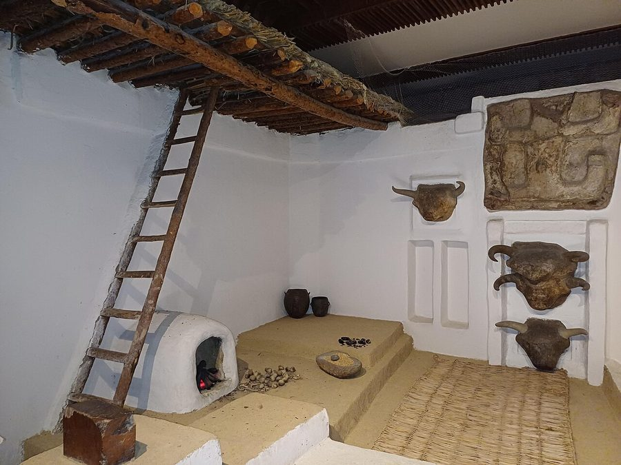
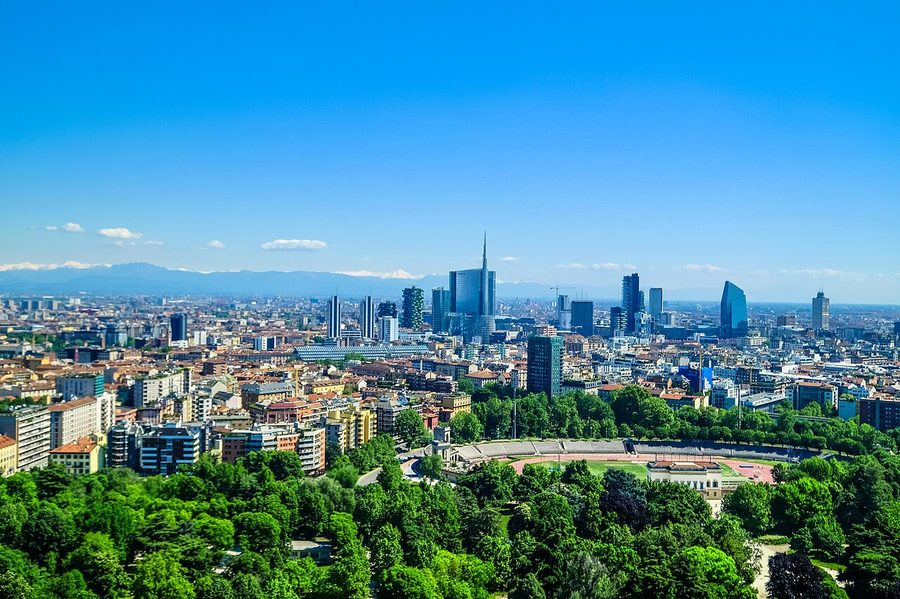
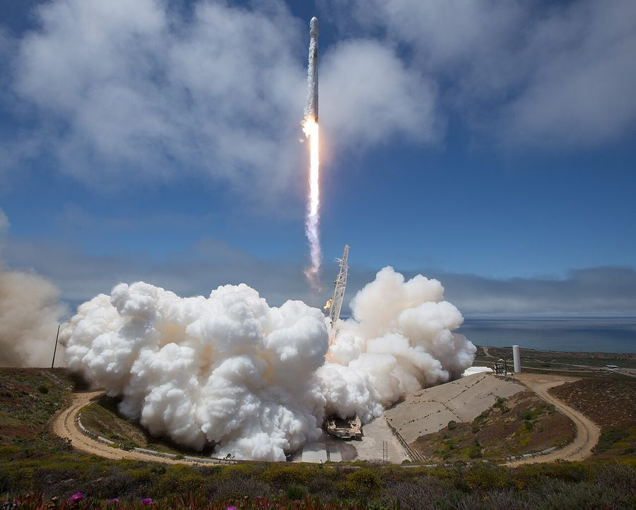

# 地表の時代の資料写真

**何を目指すかを決めるための資料である。作品に描画として使うものではない。**

画面を作るときに「どこまで寄せるか」を言葉だけで決めると、
作る側と見る側で違うものを思い浮かべる。時代ごとに1枚ずつ、
目指す絵を置いておく。

**ライセンスの明らかなものだけを集めた。** 公有・CC0・CC BY・CC BY-SA に限り、
作者と出どころとライセンスを下に控えている。CC BY と CC BY-SA は表示が条件なので、この表がその表示にあたる。

`compare.jpg` に、資料といまの画面を左右に並べてある。

## 時代ごとの資料

### 3 森林と陸上生態系

**何を参考にするか**：幹の太さと林床の暗さ。木が密に立ち並ぶ奥行き

| | |
| --- | --- |
| 作者 | Alexander Filonchik alexphilpro |
| ライセンス | CC0 |
| 出どころ | [Conifer tree trunks (Unsplash).jpg](https://commons.wikimedia.org/wiki/File%3AConifer_tree_trunks_%28Unsplash%29.jpg) |

### 4 巨大生物の時代

**何を参考にするか**：白亜紀末の植生の復元図。針葉樹と広葉樹の混ざり方

| | |
| --- | --- |
| 作者 | Landscape reconstruction by F. Guillén |
| ライセンス | CC BY 2.5 |
| 出どころ | [Main floristic types from the Maastrichtian - journal.pone.0052455.g007-left.png](https://commons.wikimedia.org/wiki/File%3AMain_floristic_types_from_the_Maastrichtian_-_journal.pone.0052455.g007-left.png) |

### 5 衝突

**何を参考にするか**：落ちてくる瞬間の空と光。地平線の向こうの明るさ

| | |
| --- | --- |
| 作者 | Donald E. Davis |
| ライセンス | Public domain |
| 出どころ | [Chicxulub impact - artist impression.jpg](https://commons.wikimedia.org/wiki/File%3AChicxulub_impact_-_artist_impression.jpg) |

### 6 氷期

**何を参考にするか**：最終氷期の景観復元。雪と枯れ草の色、まばらな木

| | |
| --- | --- |
| 作者 | Márton Zsoldos |
| ライセンス | CC BY 4.0 |
| 出どころ | [Central Europe last glacial landscape.jpg](https://commons.wikimedia.org/wiki/File%3ACentral_Europe_last_glacial_landscape.jpg) |

### 7 人類の広がり

**何を参考にするか**：チャタルホユックの復元。平屋根と背中合わせの並び

| | |
| --- | --- |
| 作者 | Radosław Botev |
| ライセンス | CC BY 3.0 pl |
| 出どころ | [Reconstruction of Neolithic buildings in Çatalhöyük.jpg](https://commons.wikimedia.org/wiki/File%3AReconstruction_of_Neolithic_buildings_in_%C3%87atalh%C3%B6y%C3%BCk.jpg) |

### 8 情報と接続

**何を参考にするか**：高層ビルの並びと、そのあいだの抜け

| | |
| --- | --- |
| 作者 | Francesco Ungaro |
| ライセンス | CC0 |
| 出どころ | [Milan skyline skyscrapers of Porta Nuova business district.jpg](https://commons.wikimedia.org/wiki/File%3AMilan_skyline_skyscrapers_of_Porta_Nuova_business_district.jpg) |

### 8 情報と接続（打ち上げ）

**何を参考にするか**：打ち上げの噴煙と機体の見え方

| | |
| --- | --- |
| 作者 | Bill Ingalls |
| ライセンス | Public domain |
| 出どころ | [GRACE-FO Launch (NHQ201805220019).jpg](https://commons.wikimedia.org/wiki/File%3AGRACE-FO_Launch_%28NHQ201805220019%29.jpg) |

## 使い方

**そっくりに作ることを目指すものではない。** この作品は球と円錐と
写真計測の素材を混ぜたデフォルメであり、写真そのものには届かない。
資料から取るのは、**構図・色の幅・密度・奥行きの付け方**である。

| 取るもの | 取らないもの |
| --- | --- |
| 空と地面の色の幅 | 葉脈や樹皮の細かさ |
| 手前・中景・遠景の分かれ方 | 実在の種や地形 |
| 植物の密度と背丈の散らばり | 写真の画角そのもの |
| 光の当たり方と影の濃さ | |
