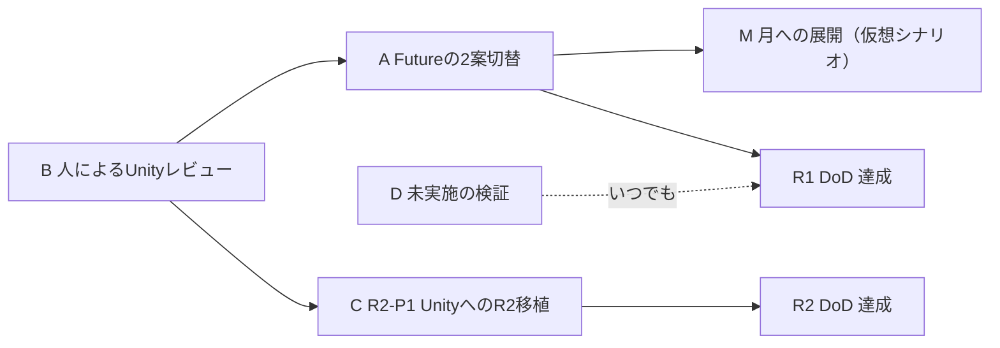

# R1-P1以降の実装順序

状態：レビュー用の案。オーナー承認前の項目を含む。**本書は実装の承認ではない。** 各段階の着手には、[AGENTS.md](../../AGENTS.md) が求める明示承認が要る。

## 本書を書いた理由

計画文書は [R1-P1実装順序](IMPLEMENTATION_ORDER_R1_P1.md) までしかなく、Unity最小再現が終わったあとの順序が決まっていない。[ロードマップ](ROADMAP.md) は段階の一覧を示すが、それは「レビュー用の案。日付・納期・実装承認を意味しない」と自ら述べており、次に何をどの順でやるかまでは定めていない。

本書はその空白を埋める。

## いまの到達点

| 段階 | 状態 |
|---|---|
| R0 基盤（文書） | 完了 |
| R1-P0 ブラウザモック | 完了。[人によるレビュー](../reports/R1_P0_HUMAN_REVIEW.md)済み |
| R2-P0 生命圏のブラウザ拡張 | 完了。[人によるレビュー](../reports/R2_P0_HUMAN_REVIEW.md)済み |
| R1-P1 Unity最小再現 | 完了。[実装報告](../reports/R1_P1_UNITY_IMPLEMENTATION.md)済み。人によるレビューは未実施 |

**R1全体のDefinition of Doneは未達である。** FR-04／AC-05（Futureの2案切替）がブラウザ・Unityとも未実装である。

## 未了の項目

| # | 項目 | 出典 | なぜ残っているか |
|---|---|---|---|
| A | FR-04／AC-05 Futureの2案切替 | [R1要件](../requirements/REQUIREMENTS_R1.md) | 両実装の対称性を保つため意図的に繰り延べた |
| B | 人によるUnityレビュー | [R1-P1実装順序](IMPLEMENTATION_ORDER_R1_P1.md) UG-09 | R1-P1の完了直後であり、これから |
| C | R2-P1 UnityへのR2移植 | [R2実装順序](IMPLEMENTATION_ORDER_R2.md) | R1-P1の完了待ちだった |
| D | スクリーンリーダー・Edge・実機端末での検証 | [R1-P0](../reports/R1_P0_HUMAN_REVIEW.md)／[R2-P0](../reports/R2_P0_HUMAN_REVIEW.md) | 人と実機が要る |

## 順序

依存の向きで決める。番号は優先度ではなく順序である。

**Bを最初に置く理由。** R1-P1は機械で確かめられる範囲しか検証していない。人が操作して初めて分かる問題を、後続の実装へ持ち越さないためである。

**AをMより先に置く理由。** Mは「Futureの仮想シナリオのひとつ」として実装する。シナリオを切り替える仕組みがFR-04そのものであり、Aを飛ばすとMの受け皿が無い。

## 段階M：月への展開

### 位置づけと、原則との関係

オーナーから「未来では月にテラフォームするところまで見たい。衛星が回る中で月も見えるようズームアウトし、ロケットが行き来しながら月のインフラができる様子が欲しい」という要望があった。

**これは原則と衝突しうる。** [AGENTS.md](../../AGENTS.md) の第一文は「探索的・象徴的シミュレーターであり、**未来を一点で予言しない**」と定める。Futureの解説も「未来は一つに決まった結末ではありません」「確率・実現年を示さない」と述べている。月開発を「未来の姿」として常に見せると、ひとつの未来を断定することになる。

**衝突を避ける形として、Futureの仮想シナリオのひとつとして実装する。**

- 仮想シナリオとして扱い、データ品質状態は「仮想シナリオ案」のままとする
- 他のシナリオ（協働と保全／資源制約への適応）と対等に並べ、優劣も確率も実現年も示さない
- 断定する語を画面へ出さない

**オーナー判断：再生すると、Futureのあとも続けて月への展開まで進む。** 当初案では「選んだときだけ見られる」としていたが、まず見られることを優先するという判断である。

この判断により、月への展開は「見に行かないと現れないもの」ではなく「時系列をたどると現れるもの」になる。予言との距離は、次の3点で保つ。

- 名称と注記を仮想シナリオとして維持し、実現年も確率も示さない
- 時間の目盛りを与えない。Futureから先に年代ラベルを置かない
- 他のシナリオを同格で示し、これが唯一の道筋ではないことを画面に残す

この形でも、FR-04が求める「2案の切替」の仕組みは同時に実装する。

### ロードマップとの関係

[ロードマップ](ROADMAP.md) は月の居住を**R6**に置き、依存を「R4〜5、資源収支の検証」としている。段階Mはそこへ先回りする。

**したがって段階Mは、R6の実装ではない。** R6が求める「限定的な補給・居住のモデル」「資源収支」は一切持たない。持つのは、シナリオを選んだときに見られる象徴的な演出だけである。R6に着手するときは、本段階の演出を資源モデルの表示へ作り替えることになる。

この先回りを記録として残す。[R2実装順序](IMPLEMENTATION_ORDER_R2.md) がR2-P0の先行を記録したのと同じ扱いである。

### 含めるもの・含めないもの

| 含める | 含めない |
|---|---|
| 地球と月が同時に見えるまでの引き | 実際の軌道要素・距離・周期 |
| 地球と月を往復する輸送の表現 | 推進・軌道遷移の物理 |
| 月面の拠点が段階的に増える様子 | 生命維持・資源収支・費用 |
| 段階ごとの短い名称 | 実現年・確率・成否の判断 |

**「テラフォーム」という語は使わない。** 月を地球化する計画があるかのように読めるためである。段階の名称は「到達」「補給拠点」「資源利用」「居住」のように、何が増えたかだけを述べる。

### データ

新しい正本を `site/data/moon-expansion.json` に置く。[データ交換形式](../design/DATA_INTERCHANGE_R1.md) の第1層（転送契約）をそのまま使う。

| 規則 | 内容 |
|---|---|
| 正本 | `site/data/moon-expansion.json` |
| schemaVersion | `moon-1.0.0`。接頭辞のある新系列とする |
| Unity側 | `StreamingAssets/moon-expansion.json` へバイト同一コピー |
| 同一性 | blobハッシュの一致で示す |
| 検証 | 既存の `JsonParser`・`JsonRules` を再利用する |

`site/data/earth-eras.json` は変更しない。既存7ファイルにも触れない。ブラウザはこの新しいファイルを読まない。

### 実装順

| # | 内容 | 相対単位 |
|---|---|---|
| M1 | データの定義と検証。段階の一覧、各段階の象徴値 | 1s |
| M2 | 月の表示。地球と同じ手続き生成で、クレーターのある灰色の球 | 2s |
| M3 | 引き。地球と月が同時に見える位置までカメラを下げる | 1s |
| M4 | 輸送の表現。地球と月のあいだを往復する物体 | 2s |
| M5 | 月面の拠点。段階が進むと増える | 2s |
| M6 | シナリオの切替。Futureで選ぶ。FR-04を満たす | 1s |
| M7 | 検証と報告 | 2s |

相対単位は [WBS_R1](WBS_R1.md) の流儀に従う。納期を意味しない。

### 承認ゲート

| ID | 承認事項 | 段階 |
|---|---|---|
| MG-01 | 段階M全体の着手。ロードマップのR6へ先回りすること | M1前 |
| MG-02 | `site/data/moon-expansion.json` の新設。Publicで公開される | M1 |
| MG-03 | 月への展開をFutureの仮想シナリオとして扱い、かつ再生で到達させること | M1（承認済み） |
| MG-04 | 段階の名称と本数 | M1 |
| MG-05 | 各コミットとpush | 全段階 |

### 受入基準

| ID | 内容 |
|---|---|
| MAC-01 | 再生でFutureの先へ進むと月への展開が見られる。手動では飛ばすことも選ぶこともできる |
| MAC-02 | 他のシナリオと対等に並び、優劣・確率・実現年を示さない |
| MAC-03 | 引いたときも地球の時代表示が壊れない |
| MAC-04 | 正本とコピーのblobハッシュが一致する |
| MAC-05 | `site/` の既存7ファイルを変更しない |
| MAC-06 | 「テラフォーム」「移住が実現する」等、断定する語を画面へ出さない |
| MAC-07 | 動きを減らす設定で、輸送と月の周回が止まる |

## 段階F：地球ができるまで

オーナーの要望により、6時代の手前に形成過程を足した。段階Mと同じ扱いで、時代データを増やさず、`EraTimeline` の手前の段階として持つ。

**仮説に基づく象徴表現である。** 月の成り立ちについてはジャイアントインパクト説を採るが、決着した事実ではない。段階の名称に「（仮説）」を付け、説明にも常に「仮説に基づく象徴表現」と出す。

| 段階 | 内容 |
|---|---|
| 微惑星の集積 | 小さな天体が数多くぶつかり、塊が育つ |
| 原始地球 | ぶつかる天体が減り、熱を持った大きな塊になる |
| 巨大衝突（仮説） | 大きな天体が近づく |
| 月の形成（仮説） | 破片から月ができたとする仮説 |

正本は `site/data/earth-formation.json`、schemaVersion は `formation-1.0.0`。転送契約は第1層をそのまま使う。

### 受入基準

| ID | 内容 |
|---|---|
| FAC-01 | 再生すると形成過程から始まり、6時代へ続く |
| FAC-02 | 仮説であることが段階名と説明に出る |
| FAC-03 | 衝突の規模・角度・時期・回数を示さない |
| FAC-04 | 正本とコピーのblobハッシュが一致する |
| FAC-05 | `site/` の既存7ファイルを変更しない |
| FAC-06 | 動きを減らす設定で、落下・破片の回転が止まる |

## 段階A：Futureの2案切替

FR-04／AC-05を満たす。現在の `scenarioCandidates` は読み取り専用の表示に留まっている。

| # | 内容 |
|---|---|
| A1 | シナリオの選択状態を持つ。`EraTimeline` とは分ける |
| A2 | Futureのときだけ選択UIを出す |
| A3 | 選んだ案に応じて地球の見た目を変える |
| A4 | 選んでいない状態を既定とする。どれかを初期選択にしない |

**ブラウザ側にも同時に入れる。** [R1-P1実装順序](IMPLEMENTATION_ORDER_R1_P1.md) は「Unityで先に実装すると両実装の非対称が生じる」としてFR-04を繰り延べた。その理由は解消していないため、AはUnityとブラウザの両方へ同時に入れる。`site/` の変更を伴うため、別途の承認が要る。

## 段階C：R2-P1

[R2実装順序](IMPLEMENTATION_ORDER_R2.md) に従う。第1層の転送契約を再利用し、ファイル名だけを変える。第2層は `r2-` 系列のまま分離を保つ。

R1側が公開するのは `AppRoot.Playback` の `IsPlaying` と `RequestStop` だけである。R2-P1はそれ以外に依存しない。

## 未決事項

| # | 内容 |
|---|---|
| 1 | ~~段階Mを先回りするか~~ 先回りする。オーナー承認済み |
| 2 | 段階Aでブラウザを変更してよいか。R2-P0が確立した「R1はハッシュ同一で無改変」を崩す |
| 3 | 段階Mの完了後、R6へ進むときに演出を資源モデルへ作り替える範囲 |

関連：[ロードマップ](ROADMAP.md)／[R1-P1実装順序](IMPLEMENTATION_ORDER_R1_P1.md)／[R2実装順序](IMPLEMENTATION_ORDER_R2.md)／[データ交換形式](../design/DATA_INTERCHANGE_R1.md)／[R1-P1実装報告](../reports/R1_P1_UNITY_IMPLEMENTATION.md)
