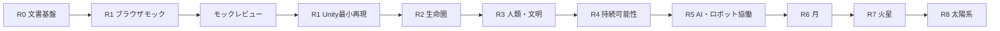

# 段階的ロードマップ

レビュー用の案。日付・納期・実装承認を意味しない。R1で操作とデータの土台を検証し、その後にモデルの複雑さを増やす。

| 段階 | 目的・含めるもの | 含めないもの | デモ可能な成果 | 次段階の条件・技術依存 |
|---|---|---|---|---|
| R0 基盤 | 要件・計画・設計、Git接続 | 実装 | 文書をたどるレビュー | 範囲と受入基準の承認 |
| R1 Earth Through Time | 6時代ブラウザモック、Unity最小再現 | 詳細な文明・気候モデル | 選択・再生できる地球 | モックレビュー後にUnity環境承認、R1受入完了 |
| R2 生命圏 | 酸素化・生態系の象徴的変化 | 生物進化の厳密計算 | 生態系条件の比較 | R1のデータ拡張・説明の検証 |
| R3 人類と文明 | 農業・都市・産業の追加 | 完全な歴史再現 | 文明の変化を追う縦切り | R2基盤、時代間接続のレビュー |
| R4 持続可能性 | 資源・環境・制度の簡易関係 | 予測精度の保証 | 条件を変えた比較 | R3、単位・制約・感度の検証 |
| R5 人間とAI・ロボット | 協働・分担・依存のシナリオ | 外部有料AI、汎用自律エージェント | 協働条件による差 | R4、比較条件と説明責任の承認 |
| R6 月の居住 | 限定的な補給・居住のモデル | 実軌道・生命維持設計 | 地球と月の依存比較 | R4〜5、資源収支の検証 |
| R7 火星の居住 | 遅延・自立性の比較 | 航行の高精度物理 | 月と火星の条件比較 | R6の共通居住データ |
| R8 太陽系への拡張 | 複数拠点・長期シナリオ | 無制限な宇宙シミュレーション | 拠点ネットワークの探索 | R7、性能と説明の検証 |

## 概念的な依存関係

## 進行規則

各リリースは要件・設計・最小実装・検証・報告のサイクルを持つ。前段階のレビューで不要と分かった項目は後続案を改訂する。Blender素材の導入は体験の不足を確認してから別途承認する。外部依存追加はロードマップに書かれていても許可されない。

関連：[R1 WBS](WBS_R1.md)／[バックログ](BACKLOG.md)
