# R1 WBS

初案。担当の「AI」は承認範囲での制作担当、「ユーザー」はレビューと判断担当。期間は見積もり用の相対作業単位であり納期ではない。

| ID | 目的 | 成果物 | 依存 | 担当 | 完了条件 | リスク |
|---|---|---|---|---|---|---|
| W1 要件 | 範囲と検証条件を合意 | R1要件 | R0 | AI／ユーザー | FR・AC・対象外をレビュー承認 | 範囲膨張 |
| W2 時代カタログ | 6時代を定義 | 時代表と品質状態 | W1 | AI／ユーザー | 6 ID・順序・象徴性が一致 | 年代の誤解 |
| W3 絵コンテ | 操作と演出を接続 | 7カット | W2 | AI／ユーザー | 6時代で全カットを説明可能 | 第7時代の混入 |
| W4 ブラウザモック | 最小体験を動かす | 承認済み仕様とローカルモック | W3、実装承認 | AI | AC-01〜08を検証可能 | データ読込・小画面 |
| W5 モックレビュー | 体験の問題を特定 | 検証報告・残課題 | W4 | ユーザー／AI | P0問題解決とUnity移行承認 | 印象だけで合格 |
| W6 Unity基盤 | データ導入経路を準備 | 承認された最小Unity基盤 | W5、環境承認 | AI | ID・順序・説明の読込確認 | Packages等の保護 |
| W7 Unity時代表示 | 地球・切替・再生を再現 | 操作可能なUnityデモ | W6 | AI | AC-09と基本操作を検証 | 表現差・性能 |
| W8 R1レビュー | R1完了判断 | 起動手順・検証報告・残課題 | W7 | ユーザー／AI | R1 DoDを満たし承認 | 未検証項目の見落とし |

## 相対ガントチャート

Mermaidの時間軸を相対単位として使用する。dateFormatのXと開始値0は描画用の数値基点であり、実日付ではない。sはここでは1相対作業単位を表す便宜的な表記で、秒数や実作業日数の見積もりではない。

```mermaid
gantt
    title R1 相対作業順（数値軸は相対単位）
    dateFormat X
    axisFormat %S
    section 設計
    W1 要件             :w1, 0, 2s
    W2 時代カタログ     :w2, after w1, 2s
    W3 絵コンテ         :w3, after w2, 2s
    section ブラウザ
    W4 モック           :w4, after w3, 4s
    W5 レビュー         :w5, after w4, 2s
    section Unity
    W6 基盤             :w6, after w5, 3s
    W7 時代表示         :w7, after w6, 4s
    W8 R1レビュー       :w8, after w7, 2s
```

図の描画環境による時間表示差がある場合も、上表の依存関係を正とする。承認待ち期間は含めていない。

関連：[要件とDoD](../requirements/REQUIREMENTS_R1.md)／[バックログ](BACKLOG.md)
